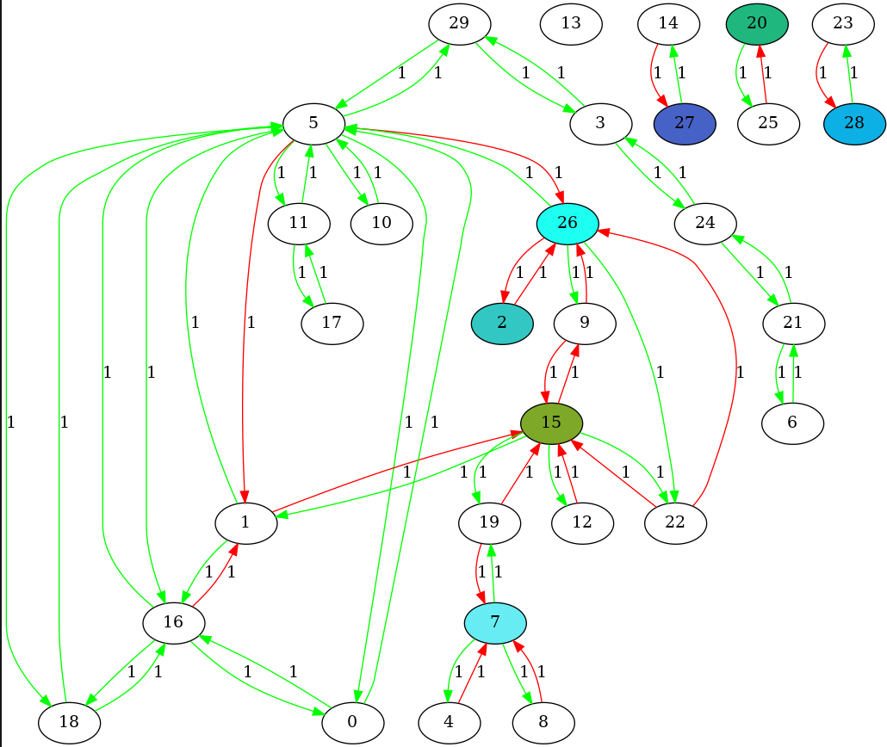
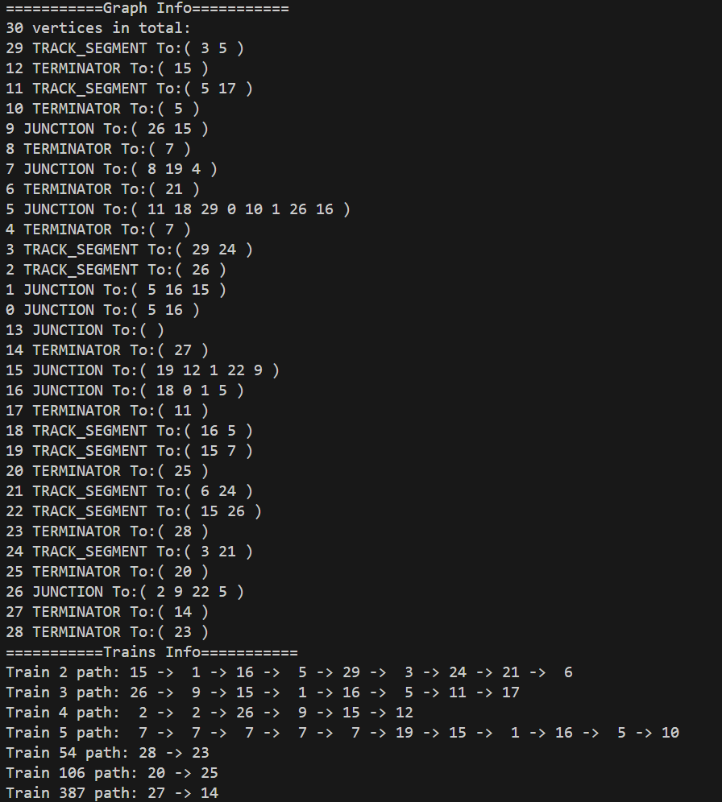

# Introduction

This program is used to simulate a train system.

# Verified Environment

Ubuntu 22.04

+ 3rd party libraries used : opencv2 (for png display)
```bash
    sudo apt install libopencv-dev 
```

+ In order to use this application, graphviz is needed. Because it will use graphviz to generate the graph picture.
```bash
    sudo apt install graphviz
```

# How to compile

```bash
    mkdir build
    cd build
    cmake ../
    make -j16
```

# How to use


+ Execute it by ...
```shell
    ./build/train_simulator graph.txt #Conduct pre-defined demo
```
Or
```shell
    ./build/train_simulator #This will generate a random graph with random 
```


# Expected effect


